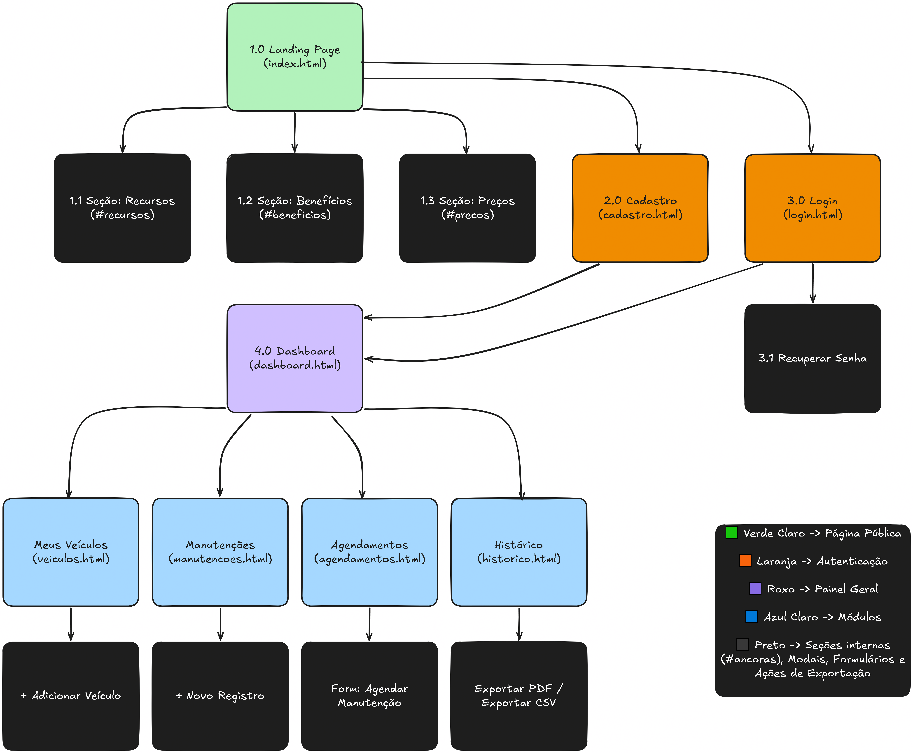
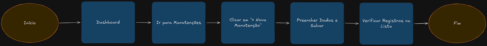
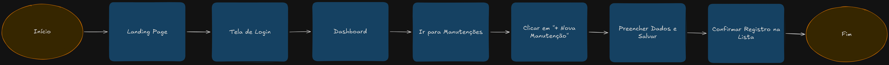
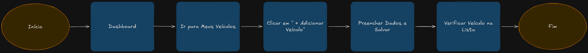
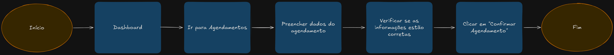

# Sitemap e Fluxos de Navegação — PreventCar

## 1. Objetivo

Esta documentação apresenta o **Mapa do Site (Sitemap)** e os **principais fluxos de navegação** do sistema.

O sitemap demonstra a hierarquia das páginas e o relacionamento entre as áreas públicas, autenticação, painel e módulos do sistema. Os fluxos representam as principais tarefas que o usuário pode realizar dentro da aplicação.

---

## 2. Mapa do Site

O mapa do site apresenta a estrutura geral da aplicação, organizando as páginas por contexto e mostrando suas relações de navegação.

### Organização

| Contexto | Páginas |
|---|---|
| **Página pública** | Landing Page, Recursos, Benefícios, Preços |
| **Autenticação** | Cadastro, Login, Recuperação de senha |
| **Painel geral** | Dashboard |
| **Módulos** | Meus Veículos, Manutenções, Agendamentos, Histórico |
| **Ações internas** | Adicionar veículo, Novo registro de manutenção, Agendar manutenção, Exportar histórico em PDF/CSV |

> **Nota:** As ações internas são acessadas a partir dos respectivos módulos no painel geral.

### Representação Visual

*Sitemap — hierarquia e relacionamento entre as páginas do sistema.*

---

## 3. Principais Fluxos de Navegação

### 3.1 Registro de manutenção

Fluxo para registrar uma nova manutenção de um veículo.

| Etapa | Ação |
|---|---|
| 1 | Acessar o Dashboard |
| 2 | Ir para Manutenções |
| 3 | Clicar em **+ Nova Manutenção** |
| 4 | Preencher os dados |
| 5 | Salvar o registro |
| 6 | Verificar o registro na lista |
| 7 | Finalizar o fluxo |

*Fluxo 01 — etapas para registrar uma nova manutenção.*

---

### 3.2 Cadastro de usuário

Fluxo para criação de uma nova conta de usuário.

| Etapa | Ação |
|---|---|
| 1 | Acessar a Landing Page |
| 2 | Ir para a Tela de Cadastro |
| 3 | Preencher os dados |
| 4 | Aceitar os termos |
| 5 | Clicar em **Realizar cadastro** |
| 6 | Acessar o Dashboard |
| 7 | Finalizar o fluxo |

*Fluxo 02 — etapas para criação de uma nova conta.*

---

### 3.3 Cadastro de veículo

Fluxo para adicionar um novo veículo à conta do usuário.

| Etapa | Ação |
|---|---|
| 1 | Acessar o Dashboard |
| 2 | Ir para Meus Veículos |
| 3 | Clicar em **+ Adicionar Veículo** |
| 4 | Preencher os dados |
| 5 | Salvar |
| 6 | Verificar o veículo na lista |
| 7 | Finalizar o fluxo |

*Fluxo 03 — etapas para adicionar um novo veículo.*

---

### 3.4 Agendamento de manutenção

Fluxo para realizar um novo agendamento de manutenção.

| Etapa | Ação |
|---|---|
| 1 | Acessar o Dashboard |
| 2 | Ir para Agendamentos |
| 3 | Preencher os dados do agendamento |
| 4 | Verificar se as informações estão corretas |
| 5 | Clicar em **Confirmar Agendamento** |
| 6 | Finalizar o fluxo |

*Fluxo 04 — etapas para realizar um novo agendamento.*

---

## 4. Relação com a SP2

Os artefatos apresentados atendem aos entregáveis definidos para a **SP2**:

- Elaborar o **Mapa do Site (Sitemap)**, demonstrando a hierarquia e o relacionamento entre as páginas;
- Definir os **principais fluxos de navegação** do usuário.

### Entregável

**Mapa do Site (Sitemap) e principais fluxos de navegação.**

---

## 5. Referências Cruzadas

- [Requisitos Funcionais e Regras de Negócio](./REQUISITOS.md) — RF01, RF02, RF03, RF04, RF05, RF06, RF07, RF08, RF09, RF10, RF11
- [Casos de Uso](./CASOS_DE_USO.md) — UC01, UC02, UC03, UC04, UC05, UC06, UC07, UC08, UC09, UC10, UC11, UC12, UC13
- [README](../README.md) — Visão geral do projeto